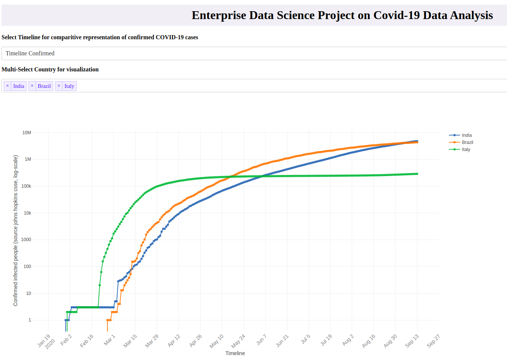

# Covid-19-Data-Analysis

Applied data science tool to analyze the spread of covid-19 

## Task 1: Dashboard for virus spread and doubling rate for individual country

#### Steps to execute Task 1

* After cloning the repository, run 'visualize.py' file from **src** folder. 

</img>

## Task 2: Using SIR model for prediction of Covid-19 infection and recovery rate for individual country.

#### Steps to execute Task 2

* After cloning the repository, run 'visualize_SIR.py' file from **src** folder.

</img>

