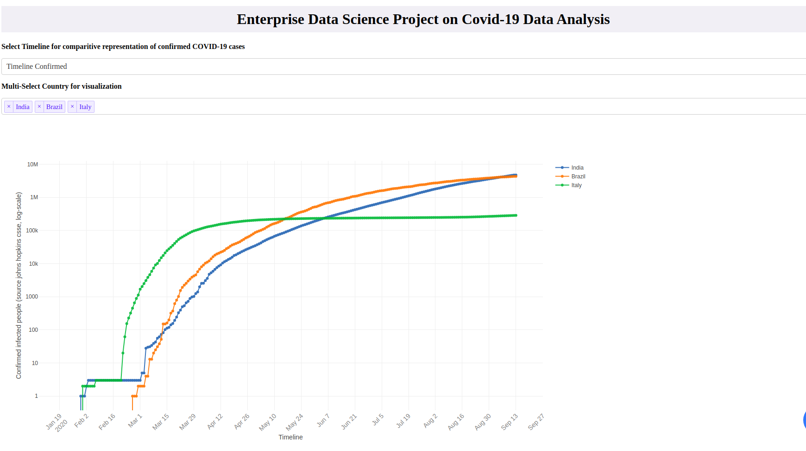

# Covid-19-Data-Analysis

Applied data science tool to analyze the spread of covid-19 

## Task 1: Dashboard for virus spread and doubling rate for individual country

#### Steps to execute Task 1

* After cloning the Covid-19-Data-Analysis repository, navigate to **src** folder and execute below command
```
python visualize.py
```
* The Dashboard will run on localhost at port - 8051. (Click the link generated after above command) 
* Make sure you have required libraries installed on your machine. See requirement.txt.

<p align='center'>
</img>
</p>

## Task 2: Using SIR model for prediction of Covid-19 infection and recovery rate for individual country.

#### Steps to execute Task 2

* After cloning the Covid-19-Data-Analysis repository, navigate to **src** folder and execute below command
```
python visualize_SIR.py
```
* The Dashboard will run on localhost at port - 8052. (Click the link generated after above command)
* Note: To use the population data for SIR modelling a new dataset file called population.csv is used. It is placed under data/population.csv

<p align='center'>
</img>
</p>
